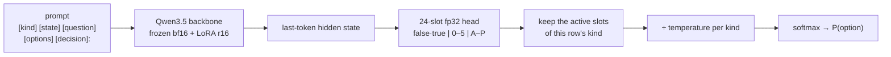

<div align="center">

# ⚖️ jev-torch

**An unofficial PyTorch implementation for training JEV-style decision models.**<br>
An LLM reads a *state*, a *question* and a list of *options*, runs **one forward pass**,<br>
and returns a **calibrated probability for every option**, with no text generation.

[](https://www.python.org/)
[](https://pytorch.org/)
[](https://github.com/huggingface/transformers)
[](https://huggingface.co/datasets/SargeDev/jev-distill-corpus-v3)
[](https://wandb.ai/)
[](LICENSE)

[Why](#-why-decision-models) •
[Quick start](#-quick-start) •
[Data format](#-data-format) •
[Recipe](#-training-recipe) •
[Hardware](#%EF%B8%8F-configs--hardware) •
[RunPod](#%EF%B8%8F-training-on-runpod) •
[Inference](#-inference) •
[Roadmap](#%EF%B8%8F-roadmap)

</div>

```text
[kind] choice
[state] The nightly feed is byte-identical to yesterday; additionally arrived 3 hours late.
[question] Root cause for this scenario.
[options]
A. producer_change
B. schema_drift
C. infrastructure
D. expected_variation
[decision]:
                         ⬇  one forward pass
              A 0.48   B 0.01   C 0.48   D 0.03      ← calibrated, sums to 1
```

> [!NOTE]
> **Status: early.** The full pipeline (training → calibration → evaluation → inference) is implemented and
> unit-tested. Multi-GPU and 4-bit training on CUDA have not been validated end to end yet, and we have not
> published our own trained weights or results. The numbers below are from the
> [autotrust/JEV](https://huggingface.co/autotrust/JEV-9B) model cards, whose recipe this project reproduces.

---

## 💡 Why decision models?

Most LLM pipelines ask a big model to *write* an answer, then parse it. Many steps are really **typed
decisions**: *Is this document relevant? Which team should get this ticket? How severe is this incident,
0–5?* A JEV-style model answers them as a **System 1**:

| | 🐢 Generative LLM ("System 2") | ⚡ JEV-style decision model ("System 1") |
|---|---|---|
| Output | free text you have to parse | a probability for each option you supplied |
| Cost | many decoding steps | **one forward pass** |
| Confidence | hard to trust | **calibrated**: 0.9 means right ~9 times in 10 |
| Use it for | open-ended reasoning | gating, routing, triage, relevance, LLM-as-judge at scale |

Calibration is what makes it practical. You can write rules like *"act if p > 0.85, otherwise escalate to the
big model or a human"*.

## ✨ Features

- 🧠 **Any Hugging Face causal LM.** Ready configs for **Qwen3.5 0.8B / 2B / 9B / 27B**, including its hybrid
  linear-attention layers. Only the text tower is loaded.
- 🎯 **24-slot decision head** initialized from the LM head's verbalizer rows, so step 0 is already a
  sensible zero-shot model.
- 📉 **Distillation losses**: KL to the teacher's full distribution, plus RPS for ordinal scores.
- 🌡️ **Per-kind temperature scaling** fit on a held-out calibration split.
- 🚀 **Scales from laptop to multi-GPU**: CPU / Apple MPS / single GPU / `torchrun` data parallel / 4-bit QLoRA.
- 🔁 **Preemption-safe**: resumable checkpoints (optimizer, scheduler, sampler position, W&B run).
- 📊 **Weights & Biases** logging, plus `report.json` with metrics by kind and domain family.
- ⚙️ **One YAML per experiment**, including the GPU count; override any field from the CLI.
- 🧩 **Pluggable data sources**: bring your own JSONL or register a dataset adapter in a few lines.

## 🚀 Quick start

```bash
git clone https://github.com/smha1012/jev-torch.git && cd jev-torch
pip install -e ".[dev]"              # on NVIDIA machines: pip install -e ".[cuda,dev]"
pytest -q                            # fast tests, no downloads

# 5-minute smoke test on a laptop (Qwen3.5-0.8B, CPU or Apple MPS)
python -m jev.launch --config configs/debug.yaml
python -m jev.predict --ckpt runs/debug/best --input examples/example.jsonl
```

## 📦 Data format

One JSON object per line. This is the schema of the
[JEV distillation corpus](https://huggingface.co/datasets/SargeDev/jev-distill-corpus-v3), so it trains out of the box.

```json
{"kind": "choice",
 "state": "A distribution center shows a count variance of 2.3%; ...",
 "question": "Supplier response for this scenario.",
 "options": ["issue_warning", "renegotiate", "dual_source", "maintain"],
 "target": [0.6, 0.07, 0.32, 0.01],
 "domain": "inventory_supply"}
```

| Field | Required | Description |
|---|:---:|---|
| `kind` | | `noul` (yes/no, exactly 2 options) · `choice` (2–16 options) · `score` (ordered 0–5). Default `choice` |
| `state` | ✅ | the situation, record or context (may be `""`) |
| `question` | ✅ | what is being decided |
| `options` | ✅ | the menu; probabilities form a distribution over exactly these |
| `target` | ✅* | teacher probability per option (soft label, auto-normalized). **The main training signal** |
| `label` | ✅* | hard label index; derived as `argmax(target)` when absent |
| `domain`, `meta` | | for filtering and reporting; unknown keys are folded into `meta` |

<sub>* one of `target` / `label`.</sub>

Soft `target`s teach the model **how uncertain to be**, not just which option wins. If several humans
labeled an item, use their vote shares; if you have a teacher model, use its output distribution.

## 🧪 Training recipe

The defaults follow the published [JEV-9B](https://huggingface.co/autotrust/JEV-9B) and
[JEV-27B](https://huggingface.co/autotrust/JEV-27B) training cards.



| Component | Setting |
|---|---|
| 🦴 Backbone | Qwen3.5 text tower, bf16, frozen |
| 🔧 LoRA | r=16, α=32, dropout 0.05 on `in_proj_qkv, in_proj_z, out_proj, q/k/v/o_proj, gate/up/down_proj` (40.1M params for 9B, 108.8M for 27B: same as JEV) |
| 🎯 Head | 24 fp32 slots: `false/true` (noul), `0–5` (score), `A–P` (choice), initialized from the LM-head rows of those tokens |
| 📉 Loss | KL(teacher ‖ model) over active slots + 0.5 · RPS on `score` rows |
| 🔀 Augmentation | 30% random permutation of `choice` options (targets follow) |
| ✂️ Context | max 1,024 tokens; an over-long state keeps its first 60% and last 40% |
| 🏃 Optimization | 128 rows/step, AdamW β=(0.9, 0.98), LoRA lr 1e-4, head lr 2e-4, cosine with 3% warmup, clip 1.0, ~1 epoch |
| 🌡️ Calibration | one temperature per kind, fit on the `calibration` split |
| ⚖️ Placeholder rows | the corpus's 148k `yuri_v1` placeholder labels get loss weight 0.1 (autotrust down-weights them; their exact weight is unpublished) |

<details>
<summary><b>📚 About the dataset</b></summary>

[`SargeDev/jev-distill-corpus-v3`](https://huggingface.co/datasets/SargeDev/jev-distill-corpus-v3): 741k
rows, 65 domains, Apache-2.0.

| Stream | Rows | What it is |
|---|---:|---|
| `yuri_v3` | 498k | synthetic operational scenarios, labeled with the full output distributions of TypeSafe Jev 1.13 |
| `yuri_v1` | 148k | memory-relevance yes/no pairs from open QA datasets (placeholder labels) |
| `openjev_v2` | 95k | [Open-Jev](https://huggingface.co/datasets/ZefanCai/Open-Jev) rows (CC0), programmatic labels |

Splits: `train` (656k), `validation`, `calibration`, `test`, `ood`, and **`test_set_30k`**, the stratified,
leakage-checked benchmark used for final evaluation.

</details>

## 🖥️ Configs & hardware

Every experiment is one YAML file in [`configs/`](configs), **including the number of GPUs**. Any field can be
overridden from the command line:

```bash
python -m jev.launch --config configs/jev-9b.yaml --set train.num_gpus=4 train.max_steps=2000
```

With `train.num_gpus > 1` the launcher re-executes itself under `torchrun` (data parallel, one full model copy
per GPU). The global batch stays at 128 rows; gradient accumulation is derived automatically.

| Config | Backbone (trainable) | GPU memory | Time for ~1 epoch |
|---|---|---|---|
| `debug.yaml` | Qwen3.5-0.8B | laptop | ⏱️ minutes (256 rows) |
| `jev-2b.yaml` | 1.9B (15.6M) | ~10 GB · est. | ~1.5 h on H100 · est. |
| `jev-9b.yaml` | 7.9B (40.1M) | ~25 GB · est. | ✅ **~3 h on 1× B200** (measured by autotrust) · ~6 h on 1× H100 · est. |
| `jev-27b.yaml` | 25.6B (108.8M) | ~60 GB · est. (autotrust peak: 79 GB) | ✅ **~9.2 h on 1× B200** (measured by autotrust) · ~3 h on 8× H100 · est. |
| `jev-27b-qlora.yaml` | 25.6B in 4-bit (108.8M) | ~30 GB · est. | slower than bf16 · not measured |

> [!TIP]
> Estimates assume gradient checkpointing and the measured B200 throughput scaled by peak bf16 FLOPs. Treat
> them as ±2×. The trainer prints **tokens/s and an ETA** every few steps, so run for a few minutes before
> committing to a long job.

## ☁️ Training on RunPod

Tested image: **`runpod/pytorch:1.0.2-cu1281-torch280-ubuntu2404`** (PyTorch 2.8.0, CUDA 12.8).
Keep the repo on the network volume (`/workspace`) so checkpoints and caches survive pod restarts.

```bash
cd /workspace && git clone https://github.com/smha1012/jev-torch.git && cd jev-torch

cp .env.sample .env.local && vi .env.local         # 🔑 HF_TOKEN, WANDB_API_KEY (both optional)
bash scripts/runpod_setup.sh configs/jev-9b.yaml    # 📦 install, check kernels, pre-download model + data
bash scripts/runpod_train.sh configs/jev-9b.yaml    # 🏃 background run → runs/jev-9b/train.log
```

`runpod_setup.sh` is built to fail early rather than after hours of GPU time:

| Step | What it guards against |
|---|---|
| 🔒 pins the image's torch, then **re-checks** it after install | pip silently replacing torch with a build for another CUDA |
| 📌 installs bounded dependency ranges, or the exact `scripts/requirements.lock` if present | a new release on pod-creation day breaking a run that worked yesterday |
| ⚡ installs and **imports** `flash-linear-attention` | Qwen3.5 falling back to a very slow pure-torch path |
| 🔑 validates `HF_TOKEN` (account, read/write role) and logs in to W&B | a bad token surfacing only when the first checkpoint is pushed |
| 🧪 **GPU smoke test**: 4 real training steps of Qwen3.5-0.8B (on 2 GPUs when available) through calibration and report | kernel, bf16, DDP or pipeline bugs before the long run (`SKIP_SMOKE=1` to skip) |

- 🔁 `runpod_train.sh` always resumes: if the pod is preempted, run the same command again and training
  continues from `runs/<name>/last`.
- 🧊 After the first successful run, freeze the versions so every future pod is identical:
  ```bash
  pip freeze > scripts/requirements.lock && git add scripts/requirements.lock && git commit -m "Lock versions"
  ```

### 📊 Weights & Biases

On by default (`train.wandb_project: jev-torch`). Logged: loss, grad norm, learning rate, tokens/s, validation
metrics, and the final test / OOD metrics by kind and family, together with the fitted temperatures.
A resumed run continues the same W&B run. Without `WANDB_API_KEY` it logs offline (`wandb sync` later);
set `train.wandb_project: null` to turn it off.

### 🤗 Automatic Hub uploads

If an HF token is available (`HF_TOKEN` in `.env.local`, an environment variable, or `hf auth login`),
training pushes checkpoints to the Hub by itself:

| When | What | Tag |
|---|---|---|
| end of every epoch | the current model (not yet calibrated) | `epoch-1`, `epoch-2`, … |
| end of training | the best checkpoint, calibrated, with a model card containing the test / OOD metrics | `final` |

```yaml
train:
  hf_push: auto          # default: <token account>/<output_dir name>, e.g. smha1012/jev-9b
  # hf_push: myorg/jev-9b   explicit repo (a missing token or write access stops the run at startup)
  # hf_push: null           never push
  hf_private: true       # repos are created private by default
```

- 🛡️ Access is checked **before** data and weights are loaded: token, write permission on the namespace,
  repo creation. A misconfiguration fails in seconds instead of after hours of training.
- ⚠️ If the repo already holds files, the run warns that it will overwrite them (older versions stay in the
  repo history). Use a different `hf_push` per run when you want to compare runs.
- 🔁 A failed upload never stops training; it is reported in the log and training continues.
- With `max_steps` shorter than one epoch (as in `jev-9b.yaml` / `jev-27b.yaml`), only the `final` push happens.
- Load any version: `JEVPredictor("smha1012/jev-9b")` (latest) or `JEVPredictor("smha1012/jev-9b", revision="epoch-1")`.

The token needs **write** access. Without a token, checkpoints simply stay in `runs/<name>/`.

### 📁 Outputs

```text
runs/jev-9b/
├── config.yaml     # fully resolved config
├── log.jsonl       # step-level training + validation log
├── last/           # resumable state: LoRA, head, optimizer, scheduler, sampler position
├── best/           # best validation-KL checkpoint, with per-kind temperatures
└── report.json     # test_set_30k / ood metrics, uncalibrated vs calibrated, by kind and family
```

| Metric | Meaning |
|---|---|
| `acc` | top-1 agrees with the teacher's top option |
| `kl` | KL divergence to the teacher distribution (lower is better) |
| `tv` | total-variation distance to the teacher distribution |
| `ece` | expected calibration error: does 0.8 confidence mean 80% correct? |
| `brier` | squared error of the probability vector |

## 🔮 Inference

Load a checkpoint from the 🤗 Hub by repo id, or from a local run directory:

```python
from jev import JEVPredictor

jev = JEVPredictor("smha1012/jev-9b")        # or JEVPredictor("runs/jev-9b/best")

jev.predict(
    kind="noul",
    state="The canary shows p99 latency up 40% after the deploy.",
    question="Should the rollout be paused?",
    options=["false", "true"],
)
# -> {'false': ..., 'true': ...}   one calibrated probability per option
```

[`examples/inference.py`](examples/inference.py) walks through all three question kinds, batch scoring, the
expected value of a `score`, and **confidence-threshold routing** (act when p ≥ 0.85, otherwise escalate):

```bash
python examples/inference.py --model smha1012/jev-9b
```

From the command line:

```bash
python -m jev.predict --ckpt smha1012/jev-9b --input my_questions.jsonl            # per-example probabilities
python -m jev.predict --ckpt smha1012/jev-9b --input labeled.jsonl --metrics       # aggregate metrics
```

### 🤗 Sharing a checkpoint manually

Training uploads automatically (see [Automatic Hub uploads](#-automatic-hub-uploads)). To upload a
checkpoint yourself:

```bash
python -m jev.push_to_hub --ckpt runs/jev-9b/best --repo <you>/jev-9b [--public] [--tag v1]
```

This uploads the LoRA adapter, the decision head with its temperatures, and a generated **model card**
(base model, training settings and the `test_set_30k` / OOD metrics from `report.json`). Use `--dry_run DIR`
to preview the card without uploading.

## 🧩 Extending

<details>
<summary><b>Use your own data</b></summary>

Write `train.jsonl`, `validation.jsonl`, `calibration.jsonl` (and any eval splits) in the format above, then:

```yaml
data:
  source: jsonl
  path: data/my_dataset
  eval_splits: [test]
```

</details>

<details>
<summary><b>Add a dataset adapter</b></summary>

```python
from jev import JEVExample, register_source

@register_source("my_data")
def my_data(cfg, split):
    rows = ...  # load however you like
    return [JEVExample(kind="choice", state=r.text, question=r.q,
                       options=r.options, target=r.probs) for r in rows]
```

Then set `data.source: my_data`. The trainer does not change.

</details>

<details>
<summary><b>Filter or re-weight the corpus</b></summary>

```yaml
data:
  include: {source: [openjev_v2, yuri_v3]}
  exclude: {family: [theology]}
  loss_weights: {source: {yuri_v1: 0.1}}
```

</details>

<details>
<summary><b>Continue training from a checkpoint</b></summary>

`JEVModel.load(ckpt, is_trainable=True)` returns a model the same `Trainer` accepts. This is the hook for
fine-tuning a general JEV on a specific domain.

</details>

## 🗂️ Project layout

```text
jev/
├── schema.py       # JEVExample: validation, JSONL I/O
├── sources.py      # data-source registry: jev_distill, jsonl, commonsense_qa
├── collate.py      # prompt, 24-slot mapping, head/tail truncation, length-grouped DDP sampler
├── model.py        # JEVModel: backbone + LoRA + head; build / load / save
├── losses.py       # KL, RPS, temperature scaling, metrics
├── trainer.py      # Trainer: DDP, sharded eval, checkpoint/resume, calibration, W&B
├── launch.py       # reads train.num_gpus, re-executes under torchrun
├── train.py        # training entry point
├── predict.py      # JEVPredictor + CLI (local or Hub checkpoints)
├── push_to_hub.py  # model card + manual upload CLI
├── hub.py          # automatic Hub uploads during training (access checks, epoch / final pushes)
└── env.py          # loads .env.local
configs/            # one YAML per experiment
scripts/            # RunPod setup / train
tests/              # fast unit tests (no downloads)
```

## 🗺️ Roadmap

- [x] JEV recipe: 24-slot head, KL + RPS, per-kind calibration
- [x] Qwen3.5 0.8B → 27B configs, multi-GPU data parallel, QLoRA
- [x] Resumable training, W&B, RunPod scripts
- [ ] End-to-end validation on multi-GPU CUDA
- [ ] Publish our own trained checkpoints and `test_set_30k` results
- [ ] Kind-stratified batches and token-budget micro-batches (as in JEV-9B)
- [x] Load from / push to the Hugging Face Hub with a generated model card
- [ ] FSDP for backbones that do not fit on one GPU

Contributions are welcome. Please open an issue first for larger changes, and run `pytest -q` before sending
a pull request.

## 🙏 Acknowledgements

- [autotrust/JEV](https://huggingface.co/autotrust/JEV-9B) for openly documenting the training recipe this
  project reproduces.
- [SargeDev/jev-distill-corpus-v3](https://huggingface.co/datasets/SargeDev/jev-distill-corpus-v3) and
  [ZefanCai/Open-Jev](https://huggingface.co/datasets/ZefanCai/Open-Jev) for the training data.
- [cexll/train-your-first-jev](https://github.com/cexll/train-your-first-jev) for the approachable introduction to JEV-style models.
- [Qwen](https://huggingface.co/Qwen) for the backbones, and 🤗 Transformers / PEFT for the plumbing.

**Unofficial:** this is an independent re-implementation. It is not affiliated with or endorsed by
TypeSafe AI (makers of Jev) or autotrust.

## 📄 License

Code is released under the [Apache-2.0 License](LICENSE).

> [!IMPORTANT]
> The corpus is Apache-2.0 (its Open-Jev stream is CC0), but its `yuri_v3` labels are outputs of the closed
> TypeSafe Jev 1.13 model. Check that model's terms before any commercial use of weights trained on them.
