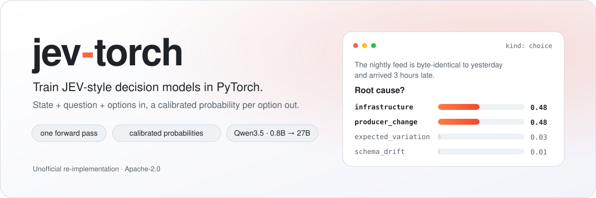
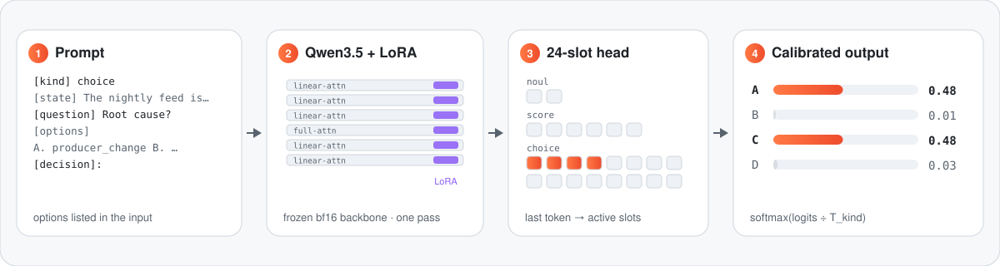

<div align="center">

<picture>
  <source media="(prefers-color-scheme: dark)" srcset="docs/assets/banner-dark.svg">
  
</picture>

<br><br>

[](https://www.python.org/)
[](https://pytorch.org/)
[](https://github.com/huggingface/transformers)
[](https://huggingface.co/datasets/SargeDev/jev-distill-corpus-v3)
[](https://wandb.ai/)
[](LICENSE)

**[Quick start](#-quick-start)** · **[How it works](#-how-it-works)** · **[Data format](#-data-format)** ·
**[Hardware](#-configs--hardware)** · **[RunPod guide](docs/runpod.md)** · **[Inference](#-inference)** ·
**[Roadmap](#-roadmap)**

</div>

<br>

> [!NOTE]
> **Status: early.** The full pipeline (training → calibration → evaluation → inference) is implemented and
> tested end to end on CPU. Multi-GPU and 4-bit training on CUDA are not validated yet, and no trained
> weights are published. Numbers marked *measured* come from the [autotrust/JEV](https://huggingface.co/autotrust/JEV-9B)
> model cards, whose recipe this project reproduces.

## 💡 Why decision models?

Most LLM pipelines ask a big model to *write* an answer and then parse it. Many of those steps are really
**typed decisions**: *Is this document relevant? Which team gets this ticket? How severe is this, 0–5?*
A JEV-style model answers them directly:

<table>
<tr>
<th width="50%">🐢 Generative LLM</th>
<th width="50%">⚡ JEV-style decision model</th>
</tr>
<tr>
<td>Writes free text you have to parse</td>
<td>Returns <b>a probability for each option you supplied</b></td>
</tr>
<tr>
<td>Many decoding steps, seconds per call</td>
<td><b>One forward pass</b>, no output tokens</td>
</tr>
<tr>
<td>"I'm confident" means little</td>
<td><b>Calibrated</b>: 0.9 means right about 9 times in 10</td>
</tr>
</table>

Calibration is what makes it useful in production: *act when p ≥ 0.85, otherwise escalate to a larger model
or a human.*

## 🔍 How it works

<picture>
  <source media="(prefers-color-scheme: dark)" srcset="docs/assets/how-it-works-dark.svg">
  
</picture>

The options are written into the prompt. The backbone runs once, and the hidden state of the last token goes
to a 24-slot head. Each slot is tied to an answer token (`false` `true` · `0`–`5` · `A`–`P`), and only the slots
for this question's kind enter the softmax. A temperature per kind, fit after training, calibrates the result.

## ✨ Features

<table>
<tr>
<td width="33%" valign="top">

**🧠 Any causal LM**<br>
<sub>Ready configs for Qwen3.5 0.8B → 27B, including its hybrid linear-attention layers.</sub>

</td>
<td width="33%" valign="top">

**🎯 Zero-shot start**<br>
<sub>Head slots start from the LM head's answer-token rows, so step 0 is already sensible.</sub>

</td>
<td width="33%" valign="top">

**📉 Distillation losses**<br>
<sub>KL to the teacher's full distribution, plus RPS for ordinal scores.</sub>

</td>
</tr>
<tr>
<td valign="top">

**🌡️ Calibrated**<br>
<sub>Per-kind temperature scaling on a held-out calibration split.</sub>

</td>
<td valign="top">

**🚀 Laptop → multi-GPU**<br>
<sub>CPU, Apple MPS, one GPU, <code>torchrun</code> data parallel, or 4-bit QLoRA.</sub>

</td>
<td valign="top">

**🔁 Preemption-safe**<br>
<sub>Resume mid-epoch: optimizer, scheduler, sampler position and W&B run.</sub>

</td>
</tr>
<tr>
<td valign="top">

**🤗 Hub integration**<br>
<sub>Checkpoints pushed every epoch and at the end, with a generated model card.</sub>

</td>
<td valign="top">

**⚙️ One YAML per run**<br>
<sub>Including the GPU count. Override any field from the command line.</sub>

</td>
<td valign="top">

**🧩 Bring your data**<br>
<sub>Your own JSONL, or a dataset adapter in a few lines.</sub>

</td>
</tr>
</table>

## 🚀 Quick start

```bash
git clone https://github.com/smha1012/jev-torch.git && cd jev-torch
pip install -e ".[dev]"            # on NVIDIA machines: pip install -e ".[cuda,dev]"
pytest -q                          # fast tests, no downloads

python -m jev.launch --config configs/debug.yaml                              # tiny run on a laptop
python -m jev.predict --ckpt runs/debug/best --input examples/example.jsonl   # score some questions
```

## 📦 Data format

One JSON object per line, the schema of the
[JEV distillation corpus](https://huggingface.co/datasets/SargeDev/jev-distill-corpus-v3):

```json
{"kind": "choice",
 "state": "A distribution center shows a count variance of 2.3%; ...",
 "question": "Supplier response for this scenario.",
 "options": ["issue_warning", "renegotiate", "dual_source", "maintain"],
 "target": [0.6, 0.07, 0.32, 0.01]}
```

| Field | | Description |
|---|:---:|---|
| `kind` | | `noul` yes/no (2 options) · `choice` (2–16 options) · `score` (ordered 0–5). Default `choice` |
| `state` | ✅ | the situation, record or context (may be `""`) |
| `question` | ✅ | what is being decided |
| `options` | ✅ | the menu; probabilities form a distribution over exactly these |
| `target` | ✅\* | teacher probability per option. **The main training signal** |
| `label` | ✅\* | hard label index; derived as `argmax(target)` when absent |

<sub>\* one of `target` / `label`. Extra keys such as `domain` are kept for filtering and reports.</sub>

Soft targets teach the model **how uncertain to be**, not only which option wins. Use human vote shares or a
teacher model's output distribution.

## 🧪 Training recipe

Defaults follow the published [JEV-9B](https://huggingface.co/autotrust/JEV-9B) and
[JEV-27B](https://huggingface.co/autotrust/JEV-27B) training cards.

| Component | Setting |
|---|---|
| 🦴 **Backbone** | Qwen3.5 text tower, bf16, frozen |
| 🔧 **LoRA** | r 16 · α 32 · dropout 0.05 on every projection (40.1M params for 9B, 108.8M for 27B, same as JEV) |
| 🎯 **Head** | 24 fp32 slots: `false/true` · `0–5` · `A–P`, initialized from those tokens' LM-head rows |
| 📉 **Loss** | KL(teacher ‖ model) over active slots + 0.5 · RPS on `score` rows ([configurable](#-extending)) |
| 🔀 **Augmentation** | 30% of `choice` rows get their options shuffled (targets follow) |
| ✂️ **Context** | 1,024 tokens; a long state keeps its first 60% and last 40% |
| 🏃 **Optimization** | 128 rows/step · AdamW β (0.9, 0.98) · LoRA lr 1e-4, head lr 2e-4 · cosine, 3% warmup · ~1 epoch |
| 🌡️ **Calibration** | one temperature per kind, fit on the `calibration` split |

<details>
<summary><b>📚 About the dataset</b></summary>
<br>

[`SargeDev/jev-distill-corpus-v3`](https://huggingface.co/datasets/SargeDev/jev-distill-corpus-v3): 741k rows,
65 domains, Apache-2.0.

| Stream | Rows | What it is |
|---|---:|---|
| `yuri_v3` | 498k | synthetic operational scenarios with the full output distributions of TypeSafe Jev 1.13 |
| `yuri_v1` | 148k | document-relevance yes/no pairs with placeholder labels (loss weight 0.1 here; autotrust down-weights them too) |
| `openjev_v2` | 95k | [Open-Jev](https://huggingface.co/datasets/ZefanCai/Open-Jev) rows (CC0) with programmatic labels |

Splits: `train` (656k) · `validation` · `calibration` · `ood` · **`test_set_30k`** (stratified, leakage-checked
benchmark used for final evaluation).

**Pinned.** The configs read the dataset at a fixed commit (`data.hf_revision`), so every run sees the same
data. To also guard against the source disappearing, snapshot it into your namespace with
`scripts/mirror_dataset.py` and point `data.hf_dataset` at the copy.

</details>

## 💻 Configs & hardware

Every experiment is one YAML in [`configs/`](configs), **including the number of GPUs**:

```bash
python -m jev.launch --config configs/jev-9b.yaml --set train.num_gpus=4 train.max_steps=2000
```

With `num_gpus > 1` the launcher re-executes under `torchrun` (data parallel). The global batch stays at 128
rows; gradient accumulation is derived automatically.

| Config | Backbone · trainable | GPU memory | Time for ~1 epoch |
|---|---|---|---|
| `debug.yaml` | Qwen3.5-0.8B | laptop | minutes (256 rows) |
| `jev-2b.yaml` | 1.9B · 15.6M | ~10 GB <sub>est.</sub> | ~1.5 h on H100 <sub>est.</sub> |
| `jev-9b.yaml` | 7.9B · 40.1M | ~25 GB <sub>est.</sub> | **~3 h on 1× B200** <sub>measured</sub> · ~6 h on H100 <sub>est.</sub> |
| `jev-27b.yaml` | 25.6B · 108.8M | ~60 GB <sub>est.</sub> · 79 GB peak <sub>measured</sub> | **~9.2 h on 1× B200** <sub>measured</sub> · ~3 h on 8× H100 <sub>est.</sub> |
| `jev-27b-qlora.yaml` | 25.6B 4-bit · 108.8M | ~30 GB <sub>est.</sub> | slower than bf16 |

> [!TIP]
> Estimates are ±2×. The trainer prints **tokens/s and an ETA** every few steps: watch the first minutes
> before committing to a long run.

## 🏃 Training on RunPod

> [!IMPORTANT]
> **Tested only on** RunPod `runpod/pytorch:1.0.2-cu1281-torch280-ubuntu2404` with **2× H100 SXM** (torch 2.8,
> Triton 3.4); validation is in progress. Other GPUs behave differently, see
> [Other GPUs](docs/runpod.md#other-gpus).

> [!TIP]
> 📘 **New to RunPod? Follow the [step-by-step guide](docs/runpod.md)**: choosing a GPU and disk, tokens,
> setup, watching a run, resuming, publishing the result, and troubleshooting.

Tested image: **`runpod/pytorch:1.0.2-cu1281-torch280-ubuntu2404`** (PyTorch 2.8, CUDA 12.8). Keep the repo on
the network volume (`/workspace`) so checkpoints and caches survive restarts.

<table>
<tr>
<td width="33%" valign="top">

**① Configure**

```bash
echo "HF_TOKEN=hf_..." > .env.local
echo "WANDB_API_KEY=..." >> .env.local
```
<sub><code>WANDB_API_KEY</code> is optional</sub>

</td>
<td width="33%" valign="top">

**② Set up**

```bash
bash scripts/runpod_setup.sh \
  configs/jev-9b.yaml
```
<sub>install, checks, 4-step GPU smoke test</sub>

</td>
<td width="33%" valign="top">

**③ Train**

```bash
bash scripts/runpod_train.sh \
  configs/jev-9b.yaml
```
<sub>background run, auto-resume, Hub push</sub>

</td>
</tr>
</table>

<details>
<summary><b>🛡️ What the setup script checks</b></summary>
<br>

It is built to fail in minutes, not after hours of GPU time:

| Step | Guards against |
|---|---|
| 🔒 pins the image's torch and **re-checks** it after install | pip swapping in a torch built for another CUDA |
| 📌 bounded dependency ranges, or the exact `scripts/requirements.lock` | a new release on pod-creation day breaking yesterday's run |
| ⚡ installs and **imports** `flash-linear-attention` | Qwen3.5 silently falling back to a very slow path |
| 🔑 validates `HF_TOKEN` (account, role) and logs in to W&B | a bad token surfacing at the first checkpoint push |
| 🧪 **GPU smoke test**: 4 real steps of Qwen3.5-0.8B, on 2 GPUs when available | kernel, bf16, DDP or pipeline bugs (`SKIP_SMOKE=1` to skip) |

After the first successful run, freeze the versions: `pip freeze > scripts/requirements.lock`.

</details>

<details>
<summary><b>🙋 Personal settings</b></summary>
<br>

Keep your own dataset mirror or Hub repo out of the shared configs by putting overrides in `.env.local`
(never committed). They are applied before `--set` and printed in the log:

```bash
echo 'JEV_OVERRIDES="data.hf_dataset=your-name/jev-distill-corpus-v3 train.hf_push=your-name/jev-9b-v2"' >> .env.local
```

</details>

### 🤗 Automatic Hub uploads

With an HF token available, training publishes checkpoints **to the token owner's account**:

| When | What | Tag |
|---|---|---|
| every epoch end | the current model (not yet calibrated) | `epoch-1`, `epoch-2`, … |
| end of training | the calibrated best checkpoint + a model card with test / OOD metrics | `final` |

```yaml
train:
  hf_push: auto        # <token account>/<run name>; or "org/name"; or null to disable
  hf_private: true     # new repos are private
```

Access is checked **before** data and weights load, existing repos trigger an overwrite warning, and a failed
upload never stops training. With `max_steps` under one epoch (the 9B/27B defaults) only `final` is pushed.

<details>
<summary><b>📊 Weights & Biases · 📁 Outputs · 📏 Metrics</b></summary>
<br>

**W&B** is on by default (`train.wandb_project`). It logs loss, grad norm, lr, tokens/s, validation metrics and
the final metrics by kind and family. Resumed runs continue the same W&B run; without `WANDB_API_KEY` it logs
offline.

```text
runs/jev-9b/
├── config.yaml     # fully resolved config
├── log.jsonl       # step-level training + validation log
├── last/           # resumable state
├── best/           # best validation-KL checkpoint with per-kind temperatures
└── report.json     # test_set_30k / ood metrics, uncalibrated vs calibrated, by kind and family
```

| Metric | Meaning |
|---|---|
| `acc` | top-1 agrees with the teacher's top option |
| `kl` | KL divergence to the teacher distribution (lower is better) |
| `tv` | total-variation distance to the teacher distribution |
| `ece` | calibration error: does 0.8 confidence mean 80% correct? |
| `brier` | squared error of the probability vector |

</details>

## 🔮 Inference

```python
from jev import JEVPredictor

jev = JEVPredictor("your-name/jev-9b")      # a Hub repo, or a local runs/<name>/best

jev.predict(
    kind="noul",
    state="The canary shows p99 latency up 40% after the deploy.",
    question="Should the rollout be paused?",
    options=["false", "true"],
)
# -> {'false': ..., 'true': ...}   one calibrated probability per option
```

[`examples/inference.py`](examples/inference.py) covers all three kinds, batch scoring, the expected value of a
score, and **confidence-threshold routing**. From the shell:

```bash
python examples/inference.py --model your-name/jev-9b
python -m jev.predict --ckpt your-name/jev-9b --input questions.jsonl
python -m jev.predict --ckpt your-name/jev-9b --input labeled.jsonl --metrics
python -m jev.evaluate --model your-name/jev-9b                              # compare with TypeSafe Jev
python -m jev.push_to_hub --ckpt runs/jev-9b/best --repo your-name/jev-9b    # manual upload
```

## 🧩 Extending

<details>
<summary><b>Use your own data</b></summary>
<br>

Put `train.jsonl`, `validation.jsonl`, `calibration.jsonl` (and any eval splits) in one folder:

```yaml
data:
  source: jsonl
  path: data/my_dataset
  eval_splits: [test]
```

</details>

<details>
<summary><b>Add a dataset adapter</b></summary>
<br>

```python
from jev import JEVExample, register_source

@register_source("my_data")
def my_data(cfg, split):
    return [JEVExample(kind="choice", state=r.text, question=r.q,
                       options=r.options, target=r.probs) for r in load_rows(split)]
```

Then set `data.source: my_data`. The trainer does not change.

</details>

<details>
<summary><b>Choose or add a loss</b></summary>
<br>

`train.loss` is a weighted sum of named terms, each optionally limited to some question kinds:

```yaml
train:
  loss:
    kl: 1.0                               # KL to the teacher distribution (default)
    rps: {weight: 0.5, kinds: [score]}    # ordinal penalty on 0–5 scores (default)
    # brier: 0.25                         # probability squared error (Open-Jev style)
    # ce: 1.0                             # hard-label cross-entropy, ignores soft targets
```

From the command line: `--set train.loss="{kl: 1.0, brier: 0.25}"`. Each term is logged separately
(`loss/kl`, `loss/rps`, …). Add your own:

```python
from jev.losses import register_loss

@register_loss("js")
def js(logits, target, option_mask, **_):   # return one value per row, shape [B]
    ...
```

</details>

<details>
<summary><b>Filter or re-weight the corpus</b></summary>
<br>

```yaml
data:
  include: {source: [openjev_v2, yuri_v3]}
  exclude: {family: [theology]}
  loss_weights: {source: {yuri_v1: 0.1}}
```

</details>

<details>
<summary><b>Continue training from a checkpoint</b></summary>
<br>

`JEVModel.load(ckpt, is_trainable=True)` returns a model the same `Trainer` accepts: the hook for fine-tuning a
general JEV on your own domain.

</details>

<details>
<summary><b>📂 Project layout</b></summary>
<br>

```text
jev/
├── schema.py       # JEVExample: validation, JSONL I/O
├── sources.py      # data sources: jev_distill, jsonl, commonsense_qa
├── collate.py      # prompt, 24-slot mapping, truncation, length-grouped DDP sampler
├── model.py        # JEVModel: backbone + LoRA + head
├── losses.py       # loss registry (kl, ce, brier, rps), temperature scaling, metrics
├── trainer.py      # DDP training, sharded eval, resume, calibration, W&B
├── hub.py          # automatic Hub uploads
├── launch.py       # reads train.num_gpus, re-executes under torchrun
├── train.py        # training entry point
├── evaluate.py     # compare a checkpoint with the teacher and the autotrust references
├── report.py       # teacher-row metrics and the comparison table
├── predict.py      # JEVPredictor + CLI
├── push_to_hub.py  # model card + manual upload
└── env.py          # .env.local and JEV_OVERRIDES
configs/            # one YAML per experiment
scripts/            # RunPod setup / train, dataset mirroring
docs/runpod.md      # step-by-step RunPod guide
docs/assets/        # README artwork (python docs/assets/build.py)
```

</details>

## 🧭 Roadmap

- [x] JEV recipe: 24-slot head, KL + RPS, per-kind calibration
- [x] Qwen3.5 0.8B → 27B configs, data parallel, QLoRA
- [x] Resumable training, W&B, RunPod scripts, Hub uploads with model cards
- [ ] Validate multi-GPU training on CUDA end to end
- [ ] Publish trained checkpoints and `test_set_30k` results
- [ ] Kind-stratified batches and token-budget micro-batches (as in JEV-9B)
- [ ] FSDP for backbones that do not fit on one GPU

Contributions are welcome. Open an issue first for larger changes, and run `pytest -q` before a pull request.

## 🔗 Related projects

| Project | Approach |
|---|---|
| [autotrust/JEV](https://huggingface.co/autotrust/JEV-9B) | Qwen3.5 9B / 27B distilled from Jev 1.13 with a 24-slot head; the recipe this repo follows |
| [Open-Jev](https://github.com/Zefan-Cai/Open-Jev) | one forward pass per candidate with a scalar head; trained on open labels |
| [train-your-first-jev](https://github.com/cexll/train-your-first-jev) | a hands-on course: a CPU byte-level scorer and a small Qwen2.5 choice scorer |

## 🙏 Acknowledgements

- [autotrust/JEV](https://huggingface.co/autotrust/JEV-9B) for openly documenting the recipe reproduced here
- [SargeDev/jev-distill-corpus-v3](https://huggingface.co/datasets/SargeDev/jev-distill-corpus-v3) and
  [ZefanCai/Open-Jev](https://huggingface.co/datasets/ZefanCai/Open-Jev) for the training data
- [Qwen](https://huggingface.co/Qwen), 🤗 Transformers and PEFT

<sub>**Unofficial.** An independent re-implementation, not affiliated with or endorsed by TypeSafe AI (makers of
Jev) or autotrust.</sub>

## 📄 License

Code: [Apache-2.0](LICENSE).

> [!IMPORTANT]
> The corpus is Apache-2.0 (its Open-Jev stream is CC0), but its `yuri_v3` labels are outputs of the closed
> TypeSafe Jev 1.13 model. Check that model's terms before any commercial use of weights trained on them.
