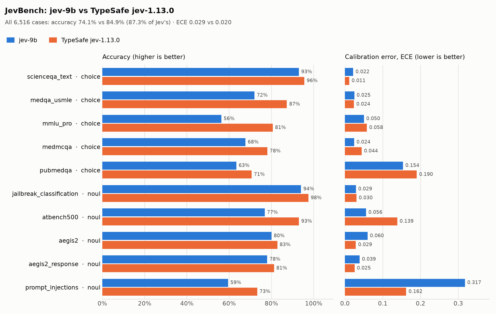

<div align="center">

<picture>
  <source media="(prefers-color-scheme: dark)" srcset="docs/assets/banner-dark.svg">
  
</picture>

<br><br>

[](https://www.python.org/)
[](https://pytorch.org/)
[](https://github.com/huggingface/transformers)
[](https://huggingface.co/datasets/SargeDev/jev-distill-corpus-v3)
[](https://wandb.ai/)
[](LICENSE)

**[Results](#-results)** · **[Metrics](#-metrics-explained)** · **[Quick start](#-quick-start)** · **[How it works](#-how-it-works)** · **[Data format](#-data-format)** ·
**[Hardware](#-configs--hardware)** · **[RunPod guide](docs/runpod.md)** · **[Inference](#-inference)** ·
**[Roadmap](#-roadmap)**

</div>

<br>

> [!NOTE]
> **Status.** JEV-9B has been trained end to end with this repo on 2× H100 SXM and matches the published
> autotrust/JEV-9B on agreement with TypeSafe Jev ([results](#-results)). JEV-27B and 4-bit (QLoRA) training
> are not run yet. Numbers marked *measured* in the hardware table come from the
> [autotrust/JEV](https://huggingface.co/autotrust/JEV-9B) model cards unless noted.

## 💡 Why decision models?

Most LLM pipelines ask a big model to *write* an answer and then parse it. Many of those steps are really
**typed decisions**: *Is this document relevant? Which team gets this ticket? How severe is this, 0–5?*
A JEV-style model answers them directly:

<table>
<tr>
<th width="50%">🐢 Generative LLM</th>
<th width="50%">⚡ JEV-style decision model</th>
</tr>
<tr>
<td>Writes free text you have to parse</td>
<td>Returns <b>a probability for each option you supplied</b></td>
</tr>
<tr>
<td>Many decoding steps, seconds per call</td>
<td><b>One forward pass</b>, no output tokens</td>
</tr>
<tr>
<td>"I'm confident" means little</td>
<td><b>Calibrated</b>: 0.9 means right about 9 times in 10</td>
</tr>
</table>

Calibration is what makes it useful in production: *act when p ≥ 0.85, otherwise escalate to a larger model
or a human.*

## 🔍 How it works

<picture>
  <source media="(prefers-color-scheme: dark)" srcset="docs/assets/how-it-works-dark.svg">
  
</picture>

The options are written into the prompt. The backbone runs once, and the hidden state of the last token goes
to a 24-slot head. Each slot is tied to an answer token (`false` `true` · `0`–`5` · `A`–`P`), and only the slots
for this question's kind enter the softmax. A temperature per kind, fit after training, calibrates the result.

## ✨ Features

<table>
<tr>
<td width="33%" valign="top">

**🧠 Any causal LM**<br>
<sub>Ready configs for Qwen3.5 0.8B–9B and Qwen3.8-27B (same hybrid linear-attention architecture).</sub>

</td>
<td width="33%" valign="top">

**🎯 Zero-shot start**<br>
<sub>Head slots start from the LM head's answer-token rows, so step 0 is already sensible.</sub>

</td>
<td width="33%" valign="top">

**📉 Distillation losses**<br>
<sub>KL to the teacher's full distribution, plus RPS for ordinal scores.</sub>

</td>
</tr>
<tr>
<td valign="top">

**🌡️ Calibrated**<br>
<sub>Per-kind temperature scaling on a held-out calibration split.</sub>

</td>
<td valign="top">

**🚀 Laptop → multi-GPU**<br>
<sub>CPU, Apple MPS, one GPU, <code>torchrun</code> data parallel, or 4-bit QLoRA.</sub>

</td>
<td valign="top">

**🔁 Preemption-safe**<br>
<sub>Resume mid-epoch: optimizer, scheduler, sampler position and W&B run.</sub>

</td>
</tr>
<tr>
<td valign="top">

**🤗 Hub integration**<br>
<sub>Checkpoints pushed every epoch and at the end, with a generated model card.</sub>

</td>
<td valign="top">

**⚙️ One YAML per run**<br>
<sub>Including the GPU count. Override any field from the command line.</sub>

</td>
<td valign="top">

**🧩 Bring your data**<br>
<sub>Your own JSONL, or a dataset adapter in a few lines.</sub>

</td>
</tr>
</table>

## 📊 Results

**JEV-9B** (`configs/jev-9b.yaml`): Qwen3.5-9B + LoRA r16 + 24-slot head, 4,750 steps × 128 rows (~0.93 epoch),
trained with this repo on **2× H100 SXM** in about 3.5 hours (~7k tokens/s).

### Agreement with the teacher

On the 25,376 rows of `test_set_30k` labelled by TypeSafe Jev 1.13, the same rows the autotrust cards
report on (`python -m jev.evaluate`):

| Metric | **jev-torch JEV-9B** | autotrust JEV-9B | autotrust JEV-27B |
|---|---:|---:|---:|
| Mean KL to teacher (lower is better) | **0.0184** | 0.0190 | 0.0170 |
| Choice top-1 agreement, teacher-labelled rows | **90.1%** | 90.2% | – |
| Choice top-1 agreement, all choice rows | **89.9%** | 89.8% | 90.3% |
| ECE vs teacher probabilities | **0.0009** | 0.0007 | 0.0009 |

The reproduction lands on the published JEV-9B numbers. Per kind: choice 90.1%, noul 95.8%, score 87.9%
top-1 agreement.

### JevBench: ground truth, next to TypeSafe Jev

On the 6,516 text cases of **Leanmcp JevBench v0.1** (a community benchmark, [what it measures](#-jevbench-accuracy-against-typesafe-jev)),
against the predictions TypeSafe's hosted Jev 1.13.0 returned for the same cases (`python -m jev.bench`):

<picture>
  <source media="(prefers-color-scheme: dark)" srcset="docs/assets/jevbench-jev-9b-dark.png">
  
</picture>

| | jev-torch JEV-9B | TypeSafe Jev 1.13.0 |
|---|---:|---:|
| Accuracy, all 6,516 cases | **74.1%** | 84.9% |
| Share of Jev's accuracy | **87.3%** | 100% |
| ECE | **0.029** | 0.020 |

- **Close to Jev** on safety and science checks: jailbreak 94% vs 98%, ScienceQA 93% vs 96%, Aegis 2.0 80% vs 83%.
- **Largest gaps** where knowledge or long inputs dominate: MMLU-Pro −24 points, agent traces (`atbench500`)
  −16, MedQA −15. The agent traces are often longer than the 1,024-token context used here.
- **Calibration** stays close to Jev's, and better on MedMCQA, PubMedQA and agent traces.

<details>
<summary><b>Per-slice numbers</b></summary>
<br>

| Slice | Kind | n | Accuracy (ours / Jev) | ECE (ours / Jev) |
|---|---|---:|---:|---:|
| medqa_usmle | choice | 1,000 | 72.0% / 87.3% | 0.025 / 0.024 |
| medmcqa | choice | 1,000 | 67.7% / 78.1% | 0.024 / 0.044 |
| pubmedqa | choice | 500 | 63.4% / 70.6% | 0.154 / 0.190 |
| mmlu_pro | choice | 1,000 | 56.3% / 80.6% | 0.050 / 0.058 |
| scienceqa_text | choice | 1,000 | 93.0% / 95.6% | 0.022 / 0.011 |
| aegis2 | noul | 500 | 80.0% / 82.8% | 0.060 / 0.029 |
| aegis2_response | noul | 500 | 78.0% / 81.2% | 0.039 / 0.025 |
| jailbreak_classification | noul | 400 | 94.0% / 97.5% | 0.029 / 0.030 |
| prompt_injections | noul | 116 | 59.5% / 73.3% | 0.317 / 0.162 |
| atbench500 | noul | 500 | 76.8% / 93.0% | 0.056 / 0.139 |

Raw results: [`docs/results/jevbench-jev-9b.json`](docs/results/jevbench-jev-9b.json). `banking77` (77 options)
and `sst5` (text withheld) are not scored.

</details>

### Next: JEV-27B

> [!NOTE]
> **TODO.** Train `configs/jev-27b.yaml` (Qwen3.8-27B, the backbone autotrust/JEV-27B uses) and add its teacher-agreement and JevBench results
> here. autotrust reports lower KL (0.017) and a much smaller out-of-domain gap for 27B than for 9B.

## 📏 Metrics explained

The two evaluations answer different questions, so they use the same metrics against different references:

| | Teacher agreement (`jev.evaluate`, `report.json`) | JevBench (`jev.bench`) |
|---|---|---|
| Question | how closely does the model copy TypeSafe Jev? | how often is it right, next to Jev? |
| Reference `t` | the teacher's probability distribution (soft) | the gold answer (one-hot) |
| Good result | numbers close to autotrust/JEV | numbers close to Jev's own |

**Notation.** For one question with options `1…K`: `p` is the model's (calibrated) probability per option,
`t` the reference distribution, `ŷ = argmax p` the option the model picks, and `conf = max p` its confidence.

### Accuracy / top-1 agreement (`acc`), higher is better

The share of questions where the model's top option is the reference's top option. Against the teacher
this is **agreement** ("would Jev have picked the same?"); on JevBench it is plain **accuracy**. For a yes/no
(`noul`) question the model says *true* when `P(true) ≥ 0.5`.

It ignores how confident the model was: 51% and 99% on the right option count the same.

### KL divergence to the teacher (`kl`), lower is better, 0 = identical

`KL(t ‖ p) = Σ t_k · log(t_k / p_k)`, averaged over questions, in nats. It compares **whole distributions**,
so it also checks that the model is as unsure as the teacher where the teacher is unsure. It is the main
training loss and the headline number for distillation.

> Teacher `[0.6, 0.4]`, model `[0.5, 0.5]`: same top option (agreement 100%), but KL = 0.020. A KL of
> 0.018 over 25k questions means the model's distributions are, on average, about that close to Jev's.

### Total-variation distance (`tv`), lower is better, 0 to 1

`½ Σ |p_k − t_k|`: the probability mass that would have to move to turn the model's answer into the
teacher's. Easier to read than KL. In the example above it is 0.10.

### Brier score (`brier`), lower is better

`Σ_k (p_k − t_k)²`, averaged. With a one-hot gold answer it ranges from 0 (certain and right) to 2 (certain and
wrong) and rewards both being right and being appropriately confident.

> Gold = option 1. Model `[0.8, 0.2]` → 0.08. Model `[0.2, 0.8]` → 1.28. Model `[0.5, 0.5]` → 0.50.

That is why a model can have a **better ECE but a worse Brier** than another: Brier also pays for being wrong
more often.

### Expected calibration error (`ece`), lower is better, 0 = perfectly calibrated

Calibration asks: **when the model says 80%, is it right about 80% of the time?** ECE sorts predictions into
confidence bins (`0–0.1, 0.1–0.2, …`; 10 bins on JevBench, 15 in `report.json`), compares in each bin the
average confidence with how often the chosen option was actually right, and averages those gaps weighted by
how many predictions fall in each bin.

> 1,000 answers given with ~90% confidence, 900 of them right → gap 0, perfect. Only 750 right → gap 0.15:
> the model is overconfident. An ECE of 0.03 means its stated confidence is off by about 3 points on average.

This calibration is what makes the "act when p ≥ 0.85, otherwise escalate" pattern safe.

- **On JevBench**, "right" means the chosen option is the gold answer: the standard ECE.
- **In `report.json` (`ece`)**, the reference is soft, so "how often right" becomes **the teacher's probability
  for the option the model chose**. This reduces to the standard ECE for one-hot targets and is 0 for a model
  that reproduces the teacher exactly.
- **`ece_top1`** compares confidence with plain top-1 agreement. With an uncertain teacher this is *not*
  calibration: if Jev says `[0.6, 0.4]`, a perfect copy is 60% confident and 100% in agreement, a "gap" of
  0.4. It is reported for reference only.

ECE alone can look good for a useless model (always answer with the base rate), so read it next to accuracy
or Brier.

### Confidence (`conf`) and temperature

`conf` is the average `max p`: how sure the model sounds. After training, one **temperature** per question
kind is fitted on the calibration split (`softmax(logits / T)`). `T > 1` softens overconfident outputs,
`T < 1` sharpens timid ones, and `T ≈ 1` (as here: 1.008 / 1.000 / 1.008) means training already left the
model calibrated.

### JevBench summary numbers

| Number | Meaning |
|---|---|
| **all cases** | metrics pooled over every case, so larger slices weigh more |
| **mean over slices** | each slice counts equally, whatever its size |
| **share of Jev's accuracy** | model accuracy ÷ Jev accuracy on the same cases (87.3% = 74.1 / 84.9) |
| **training gain** (`summary.md`) | trained − zero-shot accuracy: what fine-tuning added on top of the backbone |
| **gap to Jev** (`summary.md`) | trained − Jev accuracy: what is still missing |

**Noise.** These are samples. With 1,000 cases an accuracy is uncertain by about ±3 points (95%), with 500
about ±4, and with `prompt_injections`' 116 about ±9, so differences of a few points on a single slice can be
chance.

## 🚀 Quick start

```bash
git clone https://github.com/smha1012/jev-torch.git && cd jev-torch
uv venv --python 3.12 && source .venv/bin/activate
uv pip install -e ".[dev,plot]"    # on NVIDIA machines: ".[cuda,dev,plot]"
pytest -q                          # fast tests, no downloads

python -m jev.launch --config configs/debug.yaml                              # tiny run on a laptop
python -m jev.predict --ckpt runs/debug/best --input examples/example.jsonl   # score some questions
```

## 📦 Data format

One JSON object per line, the schema of the
[JEV distillation corpus](https://huggingface.co/datasets/SargeDev/jev-distill-corpus-v3):

```json
{"kind": "choice",
 "state": "A distribution center shows a count variance of 2.3%; ...",
 "question": "Supplier response for this scenario.",
 "options": ["issue_warning", "renegotiate", "dual_source", "maintain"],
 "target": [0.6, 0.07, 0.32, 0.01]}
```

| Field | | Description |
|---|:---:|---|
| `kind` | | `noul` yes/no (2 options) · `choice` (2–16 options) · `score` (ordered 0–5). Default `choice` |
| `state` | ✅ | the situation, record or context (may be `""`) |
| `question` | ✅ | what is being decided |
| `options` | ✅ | the menu; probabilities form a distribution over exactly these |
| `target` | ✅\* | teacher probability per option. **The main training signal** |
| `label` | ✅\* | hard label index; derived as `argmax(target)` when absent |

<sub>\* one of `target` / `label`. Extra keys such as `domain` are kept for filtering and reports.</sub>

Soft targets teach the model **how uncertain to be**, not only which option wins. Use human vote shares or a
teacher model's output distribution.

## 🧪 Training recipe

Defaults follow the published [JEV-9B](https://huggingface.co/autotrust/JEV-9B) and
[JEV-27B](https://huggingface.co/autotrust/JEV-27B) training cards.

| Component | Setting |
|---|---|
| 🦴 **Backbone** | Qwen3.5 text tower, bf16, frozen |
| 🔧 **LoRA** | r 16 · α 32 · dropout 0.05 on every projection (40.1M params for 9B, 108.8M for 27B, same as JEV) |
| 🎯 **Head** | 24 fp32 slots: `false/true` · `0–5` · `A–P`, initialized from those tokens' LM-head rows |
| 📉 **Loss** | KL(teacher ‖ model) over active slots + 0.5 · RPS on `score` rows ([configurable](#-extending)) |
| 🔀 **Augmentation** | 30% of `choice` rows get their options shuffled (targets follow) |
| ✂️ **Context** | 1,024 tokens; a long state keeps its first 60% and last 40% |
| 🏃 **Optimization** | 128 rows/step · AdamW β (0.9, 0.98) · LoRA lr 1e-4, head lr 2e-4 · cosine, 3% warmup · ~1 epoch |
| 🌡️ **Calibration** | one temperature per kind, fit on the `calibration` split |

<details>
<summary><b>📚 About the dataset</b></summary>
<br>

[`SargeDev/jev-distill-corpus-v3`](https://huggingface.co/datasets/SargeDev/jev-distill-corpus-v3): 741k rows,
65 domains, Apache-2.0.

| Stream | Rows | What it is |
|---|---:|---|
| `yuri_v3` | 498k | synthetic operational scenarios with the full output distributions of TypeSafe Jev 1.13 |
| `yuri_v1` | 148k | document-relevance yes/no pairs with placeholder labels (loss weight 0.1 here; autotrust down-weights them too) |
| `openjev_v2` | 95k | [Open-Jev](https://huggingface.co/datasets/ZefanCai/Open-Jev) rows (CC0) with programmatic labels |

Splits: `train` (656k) · `validation` · `calibration` · `ood` · **`test_set_30k`** (stratified, leakage-checked
benchmark used for final evaluation).

**Pinned.** The configs read the dataset at a fixed commit (`data.hf_revision`), so every run sees the same
data. To also guard against the source disappearing, snapshot it into your namespace with
`scripts/mirror_dataset.py` and point `data.hf_dataset` at the copy.

</details>

## 💻 Configs & hardware

Every experiment is one YAML in [`configs/`](configs), **including the number of GPUs**:

```bash
python -m jev.launch --config configs/jev-9b.yaml --set train.num_gpus=4 train.max_steps=2000
```

With `num_gpus > 1` the launcher re-executes under `torchrun` (data parallel). The global batch stays at 128
rows; gradient accumulation is derived automatically.

| Config | Backbone · trainable | GPU memory | Time for ~1 epoch |
|---|---|---|---|
| `debug.yaml` | Qwen3.5-0.8B | laptop | minutes (256 rows) |
| `jev-2b.yaml` | 1.9B · 15.6M | ~10 GB <sub>est.</sub> | ~1.5 h on H100 <sub>est.</sub> |
| `jev-9b.yaml` | 7.9B · 40.1M | ~25 GB <sub>est.</sub> | **~3.5 h on 2× H100 SXM** <sub>measured, this repo</sub> · ~3 h on 1× B200 <sub>autotrust</sub> |
| `jev-27b.yaml` | 25.6B · 108.8M | ~60 GB <sub>est.</sub> · 79 GB peak <sub>measured</sub> | **~9.2 h on 1× B200** <sub>measured</sub> · ~3 h on 8× H100 <sub>est.</sub> |
| `jev-27b-qlora.yaml` | 25.6B 4-bit · 108.8M | ~30 GB <sub>est.</sub> | slower than bf16 |

> [!TIP]
> Estimates are ±2×. The trainer prints **tokens/s and an ETA** every few steps: watch the first minutes
> before committing to a long run.

## 🏃 Training on RunPod

> [!IMPORTANT]
> **Tested only on** RunPod `runpod/pytorch:1.0.2-cu1281-torch280-ubuntu2404` with **2× H100 SXM** (torch 2.8,
> Triton 3.4); validation is in progress. Other GPUs behave differently, see
> [Other GPUs](docs/runpod.md#other-gpus).

> [!TIP]
> 📘 **New to RunPod? Follow the [step-by-step guide](docs/runpod.md)**: choosing a GPU and disk, tokens,
> setup, watching a run, resuming, publishing the result, and troubleshooting.

Tested image: **`runpod/pytorch:1.0.2-cu1281-torch280-ubuntu2404`** (PyTorch 2.8, CUDA 12.8). Keep the repo on
the network volume (`/workspace`) so checkpoints and caches survive restarts.

<table>
<tr>
<td width="33%" valign="top">

**① Configure**

```bash
echo "HF_TOKEN=hf_..." > .env.local
echo "WANDB_API_KEY=..." >> .env.local
```
<sub><code>WANDB_API_KEY</code> is optional</sub>

</td>
<td width="33%" valign="top">

**② Set up**

```bash
bash scripts/runpod_setup.sh \
  configs/jev-9b.yaml
```
<sub>install, checks, 4-step GPU smoke test</sub>

</td>
<td width="33%" valign="top">

**③ Train**

```bash
bash scripts/runpod_train.sh \
  configs/jev-9b.yaml
```
<sub>live log, auto-resume, Hub push</sub>

</td>
</tr>
</table>

<details>
<summary><b>🛡️ What the setup script checks</b></summary>
<br>

It is built to fail in minutes, not after hours of GPU time:

| Step | Guards against |
|---|---|
| 🔒 installs everything with **uv** into the image's Python, torch pinned, then **re-checks** it | a resolver swapping in a torch built for another CUDA |
| 📌 bounded dependency ranges, or the exact `scripts/requirements.lock` | a new release on pod-creation day breaking yesterday's run |
| ⚡ installs and **imports** `flash-linear-attention` | Qwen3.5 silently falling back to a very slow path |
| 🔑 validates `HF_TOKEN` (account, role) and logs in to W&B | a bad token surfacing at the first checkpoint push |
| 🧪 **GPU smoke test**: 4 real steps of Qwen3.5-0.8B, on 2 GPUs when available | kernel, bf16, DDP or pipeline bugs (`SKIP_SMOKE=1` to skip) |

After the first successful run, freeze the versions: `uv pip freeze --system > scripts/requirements.lock`.

</details>

<details>
<summary><b>🙋 Personal settings</b></summary>
<br>

Keep your own dataset mirror or Hub repo out of the shared configs by putting overrides in `.env.local`
(never committed). They are applied before `--set` and printed in the log:

```bash
echo 'JEV_OVERRIDES="data.hf_dataset=your-name/jev-distill-corpus-v3 train.hf_push=your-name/jev-9b-v2"' >> .env.local
```

</details>

### 🤗 Automatic Hub uploads

With an HF token available, training publishes checkpoints **to the token owner's account**:

| When | What | Tag |
|---|---|---|
| every epoch end | the current model (not yet calibrated) | `epoch-1`, `epoch-2`, … |
| end of training | the calibrated best checkpoint + a model card with test / OOD metrics | `final` |

```yaml
train:
  hf_push: auto        # <token account>/<run name>; or "org/name"; or null to disable
  hf_private: true     # new repos are private
```

Access is checked **before** data and weights load, existing repos trigger an overwrite warning, and a failed
upload never stops training. With `max_steps` under one epoch (the 9B/27B defaults) only `final` is pushed.

<details>
<summary><b>📊 Weights & Biases · 📁 Outputs</b></summary>
<br>

**W&B** is on by default (`train.wandb_project`). It logs loss, grad norm, lr, tokens/s, validation metrics and
the final metrics by kind and family. Resumed runs continue the same W&B run; without `WANDB_API_KEY` it logs
offline.

```text
runs/jev-9b/
├── config.yaml     # fully resolved config
├── log.jsonl       # step-level training + validation log
├── last/           # resumable state
├── best/           # best validation-KL checkpoint with per-kind temperatures
└── report.json     # test_set_30k / ood metrics, uncalibrated vs calibrated, by kind and family
```

What each metric means, with examples: [Metrics explained](#-metrics-explained).

</details>

## 🏁 JevBench: accuracy against TypeSafe Jev

`report.json` measures how closely a model copies its teacher. JevBench measures something else: **accuracy
on ground-truth answers, side by side with TypeSafe Jev itself, on the very same cases.**

### Which benchmark this is

Several community projects use the name "JevBench" and their numbers are **not comparable** with each other.
This repo uses one of them, pinned:

| | |
|---|---|
| Benchmark | **Leanmcp JevBench v0.1**, *"JevBench: An Open Evaluation Framework for Typed Decision Models"* (Pai & Xian) |
| Code / data | [github.com/Leanmcp/jevbench](https://github.com/Leanmcp/jevbench) · [huggingface.co/datasets/Leanmcp/jevbench](https://huggingface.co/datasets/Leanmcp/jevbench) at revision `ed50fe0` (tag v0.1) |
| Reference system | **TypeSafe Jev 1.13.0**: its per-case predictions, collected by the benchmark authors from `api.typesafe.ai` on 2026-09-26 and published with the cases |
| Status | a community benchmark, **not official** and not endorsed by TypeSafe; released about two weeks after Jev |

### What the code measures

Each case is a question from an established public dataset with a known answer, turned into a typed decision.
`python -m jev.bench` scores **10 text slices**:

| Slice | Kind | Cases | Source dataset | The decision |
|---|---|---:|---|---|
| `medqa_usmle` | choice | 1,000 | [MedQA-USMLE](https://huggingface.co/datasets/GBaker/MedQA-USMLE-4-options) | best answer to a USMLE clinical vignette (4 options) |
| `medmcqa` | choice | 1,000 | [MedMCQA](https://huggingface.co/datasets/openlifescienceai/medmcqa) | medical entrance-exam question (4 options) |
| `pubmedqa` | choice | 500 | [PubMedQA](https://huggingface.co/datasets/qiaojin/PubMedQA) | does the abstract answer the research question: yes / no / maybe |
| `mmlu_pro` | choice | 1,000 | [MMLU-Pro](https://huggingface.co/datasets/TIGER-Lab/MMLU-Pro) | multi-domain knowledge question (10 options) |
| `scienceqa_text` | choice | 1,000 | [ScienceQA](https://huggingface.co/datasets/derek-thomas/ScienceQA) | grade-school science question, text only |
| `aegis2` | noul | 500 | [Aegis 2.0](https://huggingface.co/datasets/nvidia/Aegis-AI-Content-Safety-Dataset-2.0) | is this user prompt unsafe? |
| `aegis2_response` | noul | 500 | Aegis 2.0 | is this assistant response unsafe? |
| `jailbreak_classification` | noul | 400 | [jailbreak-classification](https://huggingface.co/datasets/jackhhao/jailbreak-classification) | is this prompt a jailbreak attempt? |
| `prompt_injections` | noul | 116 | [deepset prompt-injections](https://huggingface.co/datasets/deepset/prompt-injections) | does this text try to inject instructions? |
| `atbench500` | noul | 500 | [ATBench](https://huggingface.co/datasets/AI45Research/ATBench) | is this AI agent's tool-use trajectory unsafe? |

Choice slices contain every question twice, once with the options reordered, so 1,000 cases are 500 questions.
**Not scored:** `banking77` (77 options, more than the head's 16 choice slots), `sst5` (its text is withheld by
the release) and the two image slices (this is a text model).

**How a case is scored.** The case's `state` fields are rendered as labelled text, the options keep their
order, and a noul question gets its true/false meaning appended. The model's calibrated probabilities are then
scored against the gold answer: **accuracy** (top option; for noul `P(true) ≥ 0.5`), **ECE** (10 confidence
bins) and **Brier**. TypeSafe's probabilities for the same cases go through the same code, case by case; doing
so reproduces the per-slice accuracies the benchmark publishes for Jev (9 of 10 slices exactly, the tenth
within one tied case). Inputs are cut to 1,024 tokens by default (`--max_length`), which matters for the long
agent trajectories in `atbench500`.

**Limits to keep in mind.** The source datasets are public, so parts may have been seen during the
pretraining of any model compared here (the release marks them as likely exposed). Jev's numbers come from a
single run on one date. Rendering choices (how `state` is turned into text, the noul hint) affect results,
and the reported numbers here are for this rendering.

### Running it

One command runs the full report: the trained model, its **untrained backbone** as a baseline (a fresh head
starting from the base model's own answer-token preferences, no training), charts and a summary table:

```bash
python -m jev.bench_report --model your-name/jev-9b        # -> bench/jev-9b/
```

`bench/jev-9b/` then holds `bench.json`, `bench-zeroshot.json`, `bench.png` / `bench-dark.png` (three bars per
slice: zero-shot, trained, Jev) and `summary.md`, which splits each slice's result into **what training
added** and **the remaining gap to Jev**. Finished steps are reused on re-runs (`--rerun` to recompute). The
pieces also run on their own: `python -m jev.bench --model ...`, `--zero_shot BASE`, `python -m jev.plot_bench`.

## 🔮 Inference

```python
from jev import JEVPredictor

jev = JEVPredictor("your-name/jev-9b")      # a Hub repo, or a local runs/<name>/best

jev.predict(
    kind="noul",
    state="The canary shows p99 latency up 40% after the deploy.",
    question="Should the rollout be paused?",
    options=["false", "true"],
)
# -> {'false': ..., 'true': ...}   one calibrated probability per option
```

[`examples/inference.py`](examples/inference.py) covers all three kinds, batch scoring, the expected value of a
score, and **confidence-threshold routing**. From the shell:

```bash
python examples/inference.py --model your-name/jev-9b
python -m jev.predict --ckpt your-name/jev-9b --input questions.jsonl
python -m jev.predict --ckpt your-name/jev-9b --input labeled.jsonl --metrics
python -m jev.evaluate --model your-name/jev-9b                              # compare with TypeSafe Jev
python -m jev.push_to_hub --ckpt runs/jev-9b/best --repo your-name/jev-9b    # manual upload
```

## 🧩 Extending

<details>
<summary><b>Use your own data</b></summary>
<br>

Put `train.jsonl`, `validation.jsonl`, `calibration.jsonl` (and any eval splits) in one folder:

```yaml
data:
  source: jsonl
  path: data/my_dataset
  eval_splits: [test]
```

</details>

<details>
<summary><b>Add a dataset adapter</b></summary>
<br>

```python
from jev import JEVExample, register_source

@register_source("my_data")
def my_data(cfg, split):
    return [JEVExample(kind="choice", state=r.text, question=r.q,
                       options=r.options, target=r.probs) for r in load_rows(split)]
```

Then set `data.source: my_data`. The trainer does not change.

</details>

<details>
<summary><b>Choose or add a loss</b></summary>
<br>

`train.loss` is a weighted sum of named terms, each optionally limited to some question kinds:

```yaml
train:
  loss:
    kl: 1.0                               # KL to the teacher distribution (default)
    rps: {weight: 0.5, kinds: [score]}    # ordinal penalty on 0–5 scores (default)
    # brier: 0.25                         # probability squared error (Open-Jev style)
    # ce: 1.0                             # hard-label cross-entropy, ignores soft targets
```

From the command line: `--set train.loss="{kl: 1.0, brier: 0.25}"`. Each term is logged separately
(`loss/kl`, `loss/rps`, …). Add your own:

```python
from jev.losses import register_loss

@register_loss("js")
def js(logits, target, option_mask, **_):   # return one value per row, shape [B]
    ...
```

</details>

<details>
<summary><b>Filter or re-weight the corpus</b></summary>
<br>

```yaml
data:
  include: {source: [openjev_v2, yuri_v3]}
  exclude: {family: [theology]}
  loss_weights: {source: {yuri_v1: 0.1}}
```

</details>

<details>
<summary><b>Continue training from a checkpoint</b></summary>
<br>

`JEVModel.load(ckpt, is_trainable=True)` returns a model the same `Trainer` accepts: the hook for fine-tuning a
general JEV on your own domain.

</details>

<details>
<summary><b>📂 Project layout</b></summary>
<br>

```text
jev/
├── schema.py       # JEVExample: validation, JSONL I/O
├── sources.py      # data sources: jev_distill, jsonl, commonsense_qa
├── collate.py      # prompt, 24-slot mapping, truncation, length-grouped DDP sampler
├── model.py        # JEVModel: backbone + LoRA + head
├── losses.py       # loss registry (kl, ce, brier, rps), temperature scaling, metrics
├── trainer.py      # DDP training, sharded eval, resume, calibration, W&B
├── hub.py          # automatic Hub uploads
├── launch.py       # reads train.num_gpus, re-executes under torchrun
├── train.py        # training entry point
├── evaluate.py     # compare a checkpoint with the teacher and the autotrust references
├── bench.py        # JevBench: ground-truth accuracy next to TypeSafe Jev 1.13.0
├── plot_bench.py   # JevBench chart: accuracy and ECE per slice
├── bench_report.py # one command: trained + zero-shot JevBench, charts, summary
├── report.py       # teacher-row metrics and the comparison table
├── predict.py      # JEVPredictor + CLI
├── push_to_hub.py  # model card + manual upload
└── env.py          # .env.local and JEV_OVERRIDES
configs/            # one YAML per experiment
scripts/            # RunPod setup / train, dataset mirroring
docs/runpod.md      # step-by-step RunPod guide
docs/assets/        # README artwork (python docs/assets/build.py)
```

</details>

## 🧭 Roadmap

- [x] JEV recipe: 24-slot head, KL + RPS, per-kind calibration
- [x] Qwen3.5 0.8B → 27B configs, data parallel, QLoRA
- [x] Resumable training, W&B, RunPod scripts, Hub uploads with model cards
- [x] Validate multi-GPU training on CUDA end to end (2× H100 SXM)
- [x] JEV-9B: train, match autotrust/JEV-9B on teacher agreement, JevBench results
- [ ] **JEV-27B: train `configs/jev-27b.yaml` and report its results** (TODO)
- [ ] Kind-stratified batches and token-budget micro-batches (as in JEV-9B)
- [ ] FSDP for backbones that do not fit on one GPU

Contributions are welcome. Open an issue first for larger changes, and run `pytest -q` before a pull request.

## 🔗 Related projects

| Project | Approach |
|---|---|
| [autotrust/JEV](https://huggingface.co/autotrust/JEV-9B) | Qwen3.5 9B / 27B distilled from Jev 1.13 with a 24-slot head; the recipe this repo follows |
| [Open-Jev](https://github.com/Zefan-Cai/Open-Jev) | one forward pass per candidate with a scalar head; trained on open labels |
| [train-your-first-jev](https://github.com/cexll/train-your-first-jev) | a hands-on course: a CPU byte-level scorer and a small Qwen2.5 choice scorer |

## 🙏 Acknowledgements

- [autotrust/JEV](https://huggingface.co/autotrust/JEV-9B) for openly documenting the recipe reproduced here
- [SargeDev/jev-distill-corpus-v3](https://huggingface.co/datasets/SargeDev/jev-distill-corpus-v3) and
  [ZefanCai/Open-Jev](https://huggingface.co/datasets/ZefanCai/Open-Jev) for the training data
- [Qwen](https://huggingface.co/Qwen), 🤗 Transformers and PEFT

<sub>**Unofficial.** An independent re-implementation, not affiliated with or endorsed by TypeSafe AI (makers of
Jev) or autotrust.</sub>

## 📄 License

| | License | Commercial use |
|---|---|---|
| **Code** (this repository) | [Apache-2.0](LICENSE) | allowed |
| **Trained weights** released from this project (e.g. `jev-9b`) | [CC BY-NC 4.0](https://creativecommons.org/licenses/by-nc/4.0/) | **not allowed** |

> [!IMPORTANT]
> **The released weights are for non-commercial use only.** Most of their training labels are outputs of
> the closed TypeSafe Jev 1.13 model (the `yuri_v3` stream of the corpus, which is itself Apache-2.0 with a
> CC0 Open-Jev stream). For other uses, contact the author.
>
> Weights **you** train with this code on the JEV corpus inherit the same caveat: check TypeSafe's terms
> before any commercial use. Models trained on your own data are governed by that data's terms.
